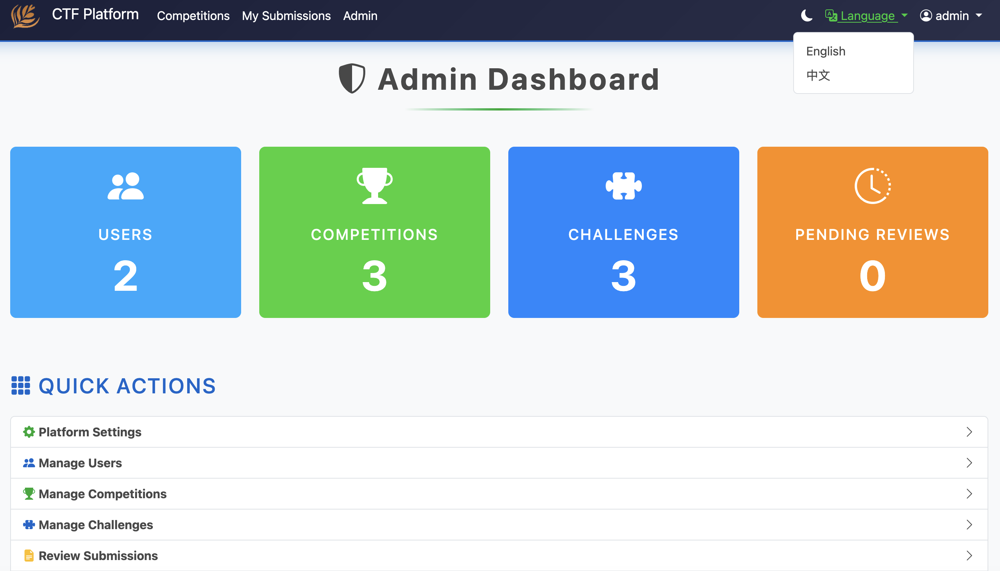
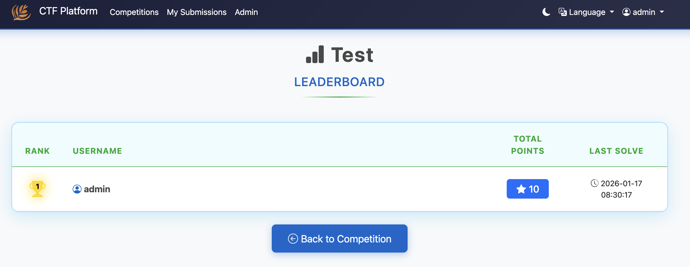
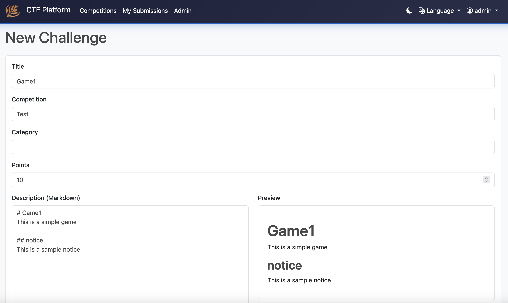

# CTF Platform

一个功能完整的 Capture The Flag（CTF）竞赛平台，使用 Python Flask 开发，支持容器化部署。

支持复杂的答题（文字+图片），通过人工审核来确认分数。

A full-featured Capture The Flag (CTF) competition platform built with Python Flask, supporting containerized deployment.

## 功能截图 / Screenshots






## 快速开始 / Quick Start

### 使用 Docker Compose / Using Docker Compose

1. 克隆仓库 / Clone the repository:
```bash
git clone <your-repo-url>
cd CTF
```

2. 复制环境变量文件 / Copy environment file:
```bash
cp .env.example .env
```

3. 修改 `.env` 文件中的配置（特别是 SECRET_KEY）/ Edit `.env` file (especially SECRET_KEY)

4. 启动服务 / Start services:
```bash
./deploy.sh
```

5. 访问平台 / Access the platform:
- Frontend: http://localhost:5000
- Default admin account: admin@ctf.local / admin123


## 主要功能 / Key Features

### 前台功能 / Frontend Features
- ✅ 用户注册和登录（邮箱登录）/ User registration and login (email-based)
- ✅ 查看竞赛和题目 / View competitions and challenges
- ✅ 在线答题（文本+图片上传）/ Submit answers (text + image uploads)
- ✅ 实时排行榜 / Real-time leaderboard
- ✅ 提交历史记录 / Submission history
- ✅ 中英文双语支持 / Chinese and English language support

### 后台功能 / Admin Features
- ✅ 平台设置（名称、Logo）/ Platform settings (name, logo)
- ✅ 用户管理 / User management
- ✅ 竞赛管理（创建、编辑、删除）/ Competition management
- ✅ 题目管理（Markdown编辑器+预览）/ Challenge management (Markdown editor with preview)
- ✅ 图片上传和插入 / Image upload and insertion
- ✅ 提交审核（人工审核）/ Submission review
- ✅ 外部Hook支持（如Dify工作流）/ External hook support (e.g., Dify workflow)

### 竞赛功能 / Competition Features
- ✅ 多竞赛管理 / Multiple competition management
- ✅ 题目分类和积分 / Challenge categories and points
- ✅ 动态排行榜（自动刷新）/ Dynamic leaderboard (auto-refresh)
- ✅ 竞赛时间控制 / Competition time control

## 技术栈 / Tech Stack

- **Backend**: Python 3.11, Flask
- **Database**: PostgreSQL
- **Cache/Queue**: Redis
- **Task Queue**: Celery
- **Frontend**: Bootstrap 5, Marked.js (Markdown)
- **Deployment**: Docker, Kubernetes


## 使用 Kubernetes / Using Kubernetes

1. 构建 Docker 镜像 / Build Docker image:
```bash
docker build -t your-registry/ctf-platform:latest .
docker push your-registry/ctf-platform:latest
```

2. 修改 `k8s-deployment.yaml` 中的镜像地址 / Update image URL in `k8s-deployment.yaml`

3. 部署到 Kubernetes / Deploy to Kubernetes:
```bash
kubectl apply -f k8s-deployment.yaml
```

4. 获取服务地址 / Get service URL:
```bash
kubectl get svc -n ctf-platform ctf-web
```

## 配置说明 / Configuration

### 环境变量 / Environment Variables

| 变量名 / Variable | 说明 / Description | 默认值 / Default |
|------------------|-------------------|-----------------|
| `SECRET_KEY` | Flask密钥 / Flask secret key | - |
| `DATABASE_URL` | 数据库连接字符串 / Database connection string | postgresql://... |
| `REDIS_URL` | Redis连接字符串 / Redis connection string | redis://localhost:6379/0 |
| `PLATFORM_NAME` | 平台名称 / Platform name | CTF Platform |
| `ADMIN_EMAIL` | 管理员邮箱 / Admin email | admin@ctf.local |
| `ADMIN_PASSWORD` | 管理员密码 / Admin password | admin123 |
| `EXTERNAL_HOOK_ENABLED` | 启用外部Hook / Enable external hook | false |
| `EXTERNAL_HOOK_URL` | 外部Hook URL / External hook URL | - |

### 外部Hook集成 / External Hook Integration

平台支持在用户提交答案后，通过POST请求触发外部服务（如Dify工作流）进行自动化审核。

The platform supports triggering external services (like Dify workflow) via POST request after user submission for automated review.

Payload格式 / Payload format:
```json
{
  "submission_id": 1,
  "user_id": 2,
  "username": "user123",
  "challenge_id": 5,
  "challenge_title": "Challenge Title",
  "answer_text": "User's answer",
  "submitted_at": "2026-01-16T12:00:00"
}
```

## 目录结构 / Directory Structure

```
CTF/
├── app.py                 # 应用入口 / Application entry
├── config.py             # 配置文件 / Configuration
├── models.py             # 数据模型 / Data models
├── forms.py              # 表单定义 / Form definitions
├── tasks.py              # Celery任务 / Celery tasks
├── requirements.txt      # 依赖包 / Dependencies
├── Dockerfile           # Docker配置 / Docker configuration
├── docker compose.yml   # Docker Compose配置
├── k8s-deployment.yaml  # Kubernetes配置
├── routes/              # 路由模块 / Route modules
│   ├── auth.py         # 认证路由 / Authentication routes
│   ├── frontend.py     # 前台路由 / Frontend routes
│   ├── admin.py        # 后台路由 / Admin routes
│   └── api.py          # API路由 / API routes
├── templates/          # 模板文件 / Templates
│   ├── base.html
│   ├── auth/
│   ├── frontend/
│   └── admin/
├── static/             # 静态文件 / Static files
└── uploads/            # 上传文件 / Uploaded files
```


## 许可证 / License

MIT License

## 贡献 / Contributing

欢迎提交Issue和Pull Request！

Welcome to submit issues and pull requests!

## 支持 / Support

如有问题，请提交Issue或联系开发者。

For questions, please submit an issue or contact the developer.
