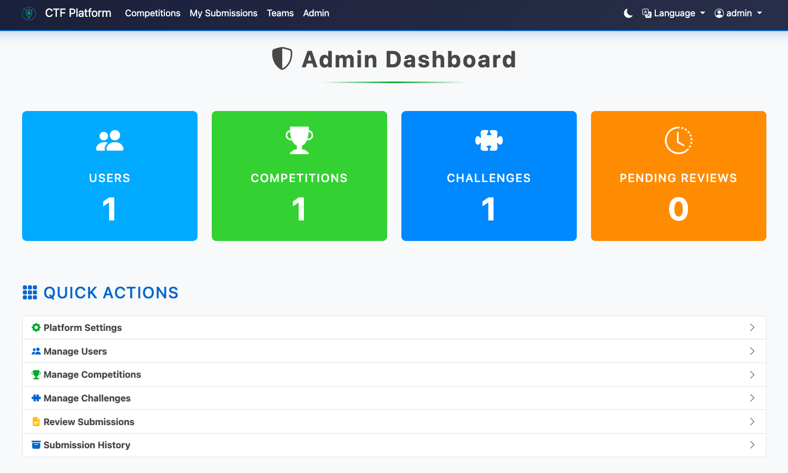
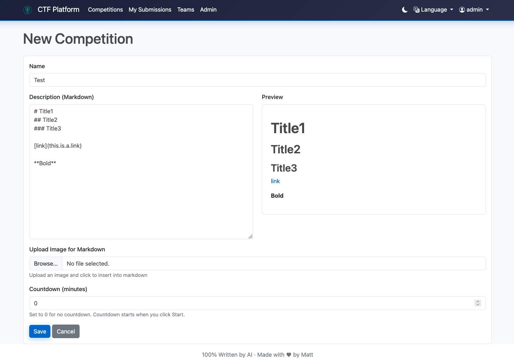
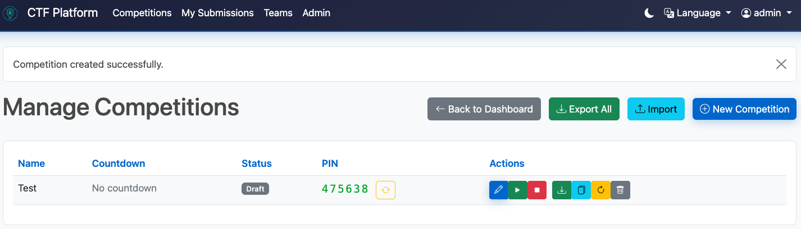
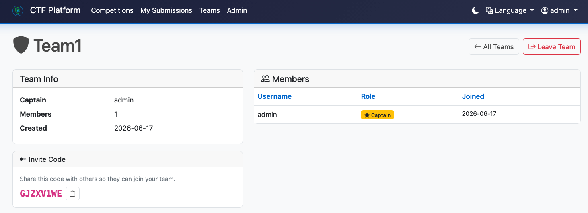
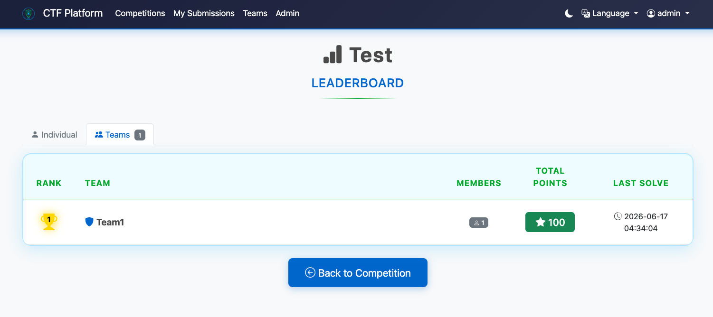
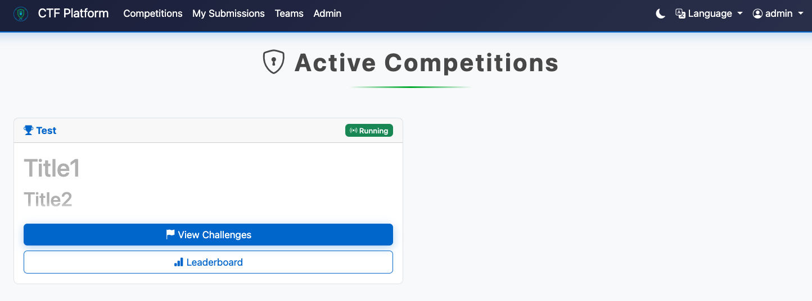

# CTF Platform

一个功能完整的 Capture The Flag（CTF）竞赛平台，使用 Python Flask 开发，支持容器化部署。

支持复杂的答题（文字+图片），可以通过人工审核或者 Dify Chatflow 对接来确认分数。

A full-featured Capture The Flag (CTF) competition platform built with Python Flask, supporting containerized deployment.

## 功能截图 / Screenshots












## 快速开始 / Quick Start

### 使用 Docker Compose / Using Docker Compose

1. 克隆仓库 / Clone the repository:
```bash
git clone <your-repo-url>
cd CTF
```

2. 复制环境变量文件 / Copy environment file:
```bash
cp .env.example .env
```

3. 修改 `.env` 文件中的配置（特别是 SECRET_KEY 和 Dify 配置）/ Edit `.env` file (especially SECRET_KEY and Dify settings):
```bash
# 必须修改的配置 / Required settings
SECRET_KEY=your-random-secret-key-here

# 如果需要 Dify 自动评分 / If you need Dify auto-scoring
EXTERNAL_HOOK_ENABLED=true
EXTERNAL_HOOK_URL=https://aisec.halfcoffee.com/v1/chat-messages
DIFY_API_KEY=app-your-dify-api-key
UPLOAD_URL_PREFIX=http://your-public-ip:5000/uploads
```

4. 启动服务 / Start services:
```bash
./deploy.sh
```

5. 访问平台 / Access the platform:
- Frontend: http://localhost:5000
- Default admin account: admin@ctf.local / admin123


## 主要功能 / Key Features

### 前台功能 / Frontend Features
- ✅ 用户注册和登录（邮箱登录）/ User registration and login (email-based)
- ✅ 查看竞赛和题目 / View competitions and challenges
- ✅ 在线答题（文本+图片上传）/ Submit answers (text + image uploads)
- ✅ 查看历史提交内容详情（含已上传图片）/ View full submission details including uploaded images
- ✅ 实时排行榜 / Real-time leaderboard
- ✅ 提交历史记录 / Submission history
- ✅ 组队参赛（创建/加入战队）/ Team participation (create / join teams)
- ✅ 竞赛 PIN 码验证（私有竞赛准入）/ Competition PIN code verification (private competition access)
- ✅ 中英文双语支持 / Chinese and English language support

### 后台功能 / Admin Features
- ✅ 平台设置（名称、Logo）/ Platform settings (name, logo)
- ✅ 用户管理 / User management
- ✅ 竞赛管理（创建、编辑、删除、PIN 码设置）/ Competition management (incl. PIN code)
- ✅ 题目管理（Markdown编辑器+预览）/ Challenge management (Markdown editor with preview)
- ✅ 图片上传和插入 / Image upload and insertion
- ✅ 提交审核（人工审核）/ Submission review
- ✅ Dify 判分结果展示作为人工审核参考 / Dify scoring result shown to admins as reference
- ✅ 外部Hook支持（全局 + 题目级 Dify 工作流）/ External hook support (global + per-challenge Dify workflow)

### 竞赛功能 / Competition Features
- ✅ 多竞赛管理 / Multiple competition management
- ✅ 题目分类和积分 / Challenge categories and points
- ✅ 动态排行榜（自动刷新）/ Dynamic leaderboard (auto-refresh)
- ✅ 智能计分：每题只计最高分 / Smart scoring: Only highest score per challenge counts
- ✅ 组队竞赛与战队榜 / Team-based competition and team leaderboard
- ✅ PIN 码私有竞赛 / PIN-protected private competitions
- ✅ 竞赛时间控制 / Competition time control

## 技术栈 / Tech Stack

- **Backend**: Python 3.11, Flask
- **Database**: PostgreSQL
- **Cache/Queue**: Redis
- **Task Queue**: Celery
- **Frontend**: Bootstrap 5, Marked.js (Markdown)
- **Deployment**: Docker, Kubernetes


## 使用 Kubernetes / Using Kubernetes

1. 构建 Docker 镜像 / Build Docker image:
```bash
docker build -t your-registry/ctf-platform:latest .
docker push your-registry/ctf-platform:latest
```

2. 修改 `k8s-deployment.yaml` 中的镜像地址 / Update image URL in `k8s-deployment.yaml`

3. 部署到 Kubernetes / Deploy to Kubernetes:
```bash
kubectl apply -f k8s-deployment.yaml
```

4. 获取服务地址 / Get service URL:
```bash
kubectl get svc -n ctf-platform ctf-web
```

## 配置说明 / Configuration

### 环境变量 / Environment Variables

| 变量名 / Variable | 说明 / Description | 默认值 / Default |
|------------------|-------------------|-----------------|
| `SECRET_KEY` | Flask密钥 / Flask secret key | - |
| `DATABASE_URL` | 数据库连接字符串 / Database connection string | postgresql://... |
| `REDIS_URL` | Redis连接字符串 / Redis connection string | redis://localhost:6379/0 |
| `PLATFORM_NAME` | 平台名称 / Platform name | CTF Platform |
| `ADMIN_EMAIL` | 管理员邮箱 / Admin email | admin@ctf.local |
| `ADMIN_PASSWORD` | 管理员密码 / Admin password | admin123 |
| `EXTERNAL_HOOK_ENABLED` | 启用外部Hook / Enable external hook | false |
| `EXTERNAL_HOOK_URL` | 外部Hook URL / External hook URL | - |
| `DIFY_API_KEY` | Dify API密钥 / Dify API key | - |
| `UPLOAD_URL_PREFIX` | 上传文件URL前缀 / Upload file URL prefix | http://localhost:5000/uploads |

### 外部Hook集成 / External Hook Integration

平台支持在用户提交答案后，通过 Dify API 进行自动化审核和评分。

The platform supports automated review and scoring via Dify API after user submission.

#### 按题目独立 Dify 配置 / Per-Challenge Dify Override

- 管理员可在每个 Challenge 中单独启用 Dify 配置（完整 Hook URL + API Key 及独立工作流）。
- API Key 会以打码方式保存展示，数据库不直接保存裸明文。
- 提交时优先使用题目级 Dify 配置；若题目未配置 API Key，则自动回退全局 `DIFY_API_KEY`。
- Dify 接口调用经过优化：超时与重试更稳健、错误日志更完整、对长答复与图片附件处理更可靠。
- Dify 返回的判分结果（含 `score` / `feedback`）会同步保留在提交记录中，管理员在审核界面可直接查看，作为人工复核的参考。

题目级 Hook URL 示例：

```bash
https://aisec.halfcoffee.com/v1/chat-messages
```

#### 配置步骤 / Configuration Steps

1. 在 `.env` 文件中添加配置 / Add configuration to `.env` file:

```bash
# 启用外部Hook功能
EXTERNAL_HOOK_ENABLED=true

# Dify Chat API URL
EXTERNAL_HOOK_URL=https://aisec.halfcoffee.com/v1/chat-messages

# Dify API Key
DIFY_API_KEY=XXXX

# 上传文件的公网访问URL前缀（需要Dify能够访问）
UPLOAD_URL_PREFIX=http://<YOUR-CTF-Platform-IP>:5000/uploads
```

2. 确保 Redis 和 Celery worker 已启动 / Ensure Redis and Celery worker are running:

```bash
celery -A tasks.celery worker --loglevel=info
```

#### Dify 请求格式 / Dify Request Format

平台会发送以下格式的请求到 Dify API：

```json
{
  "inputs": {},
  "query": "用户提交的答案文本",
  "response_mode": "blocking",
  "conversation_id": "",
  "user": "user-123",
  "files": [
    {
      "type": "image",
      "transfer_method": "remote_url",
      "url": "http://<YOUR-CTF-Platform-IP>:5000/uploads/2_20260117_090319_image.png"
    }
  ]
}
```

#### Dify 返回格式要求 / Dify Response Format

Dify 工作流需要在 `answer` 字段中返回 JSON 格式的评分结果：

```json
{
  "event": "message",
  "answer": "{\"success\": true, \"score\": 10, \"feedback\": \"答案正确\", \"auto_approved\": true}",
  "..."
}
```

`answer` 字段中的 JSON 结构：
- `success` (boolean): 是否成功评估（答案是否正确）
- `score` (integer): 得分（0-题目总分）
- `feedback` (string): 评分反馈
- `auto_approved` (boolean): 是否自动审核
  - `true`: 始终为 True，除非运行错误

#### 自动评分逻辑 / Auto-scoring Logic

当 `auto_approved=true` 时，系统会自动审核：

**答案正确（`success=true`）**：
- 提交状态：`approved` ✅
- 得分：Dify 返回的 `score` 值
- 审核人：`AI`

**答案错误（`success=false`）**：
- 提交状态：`rejected` ❌
- 得分：`0`
- 审核人：`AI`

**需要人工审核（`auto_approved=false`）**：
- 提交状态：`pending` ⏳
- 得分：`0`（待审核）
- 需要管理员在后台手动审核

### 组队功能 / Team Mode

平台支持以战队为单位参赛：

- 用户可以**创建战队**或**通过邀请码 / 战队名加入**已有战队。
- 战队成员的有效提交会贡献到战队总分，排行榜支持**个人榜**与**战队榜**两种视角。
- 同一用户在同一竞赛内只能归属一个战队；竞赛进行中可由队长进行成员管理。

The platform supports team-based participation: users can create or join a team, and submissions contribute to a shared team score with both individual and team leaderboards.

### 竞赛 PIN 码 / Competition PIN Code

为支持私有 / 受邀竞赛，平台提供 PIN 码访问控制：

- 管理员在创建或编辑竞赛时可设置 **PIN 码**（留空表示公开竞赛）。
- 用户进入受 PIN 保护的竞赛前需输入正确 PIN 码，验证通过后会话内不再重复要求。
- PIN 码错误会被限流并记录，避免暴力枚举。

When a competition is configured with a PIN code, users must enter the correct PIN before viewing challenges or submitting answers. Leaving the PIN empty makes the competition public.

### 提交内容查看 / Submission Detail View

用户可在「我的提交」中**查看每次提交的完整内容**，包括答案文本与已上传的图片附件，方便核对历史答题与申诉。

Users can review the full content of any past submission (answer text + uploaded images) from "My Submissions".

### 计分规则 / Scoring Rules

#### 多次提交同一题目 / Multiple Submissions for Same Challenge

平台采用**智能计分**策略，符合标准 CTF 竞赛规则：

- ✅ **允许多次提交**：用户可以对同一题目提交多次答案
- ✅ **只计最高分**：排行榜只计算每个用户在每道题上的**最高得分**
- ✅ **保留所有记录**：所有提交历史完整保留，可在"我的提交"中查看
- ✅ **鼓励改进**：用户可以不断优化答案争取更高分数

**示例**：
```
用户 A 对题目 1 的提交：
- 第 1 次：5 分（部分正确）
- 第 2 次：10 分（完全正确）
- 第 3 次：8 分（略有退步）

排行榜计分：max(5, 10, 8) = 10 分 ✅
（不是 5 + 10 + 8 = 23 分）
```

#### 排行榜排序 / Leaderboard Ranking

1. **主要排序**：总分从高到低
2. **次要排序**：最后解题时间从早到晚（先完成者排名靠前）

#### 原始 Payload 格式（已废弃）/ Legacy Payload Format (Deprecated)

旧版本的 webhook payload 格式（仅供参考）：

```json
{
  "submission_id": 1,
  "user_id": 2,
  "username": "user123",
  "challenge_id": 5,
  "challenge_title": "Challenge Title",
  "answer_text": "User's answer",
  "submitted_at": "2026-01-16T12:00:00"
}
```

## 目录结构 / Directory Structure

```
Simple-CTF-Platform/
├── app.py                 # 应用入口 / Application entry
├── wsgi.py                # WSGI 入口
├── config.py              # 配置文件
├── models.py              # 数据模型
├── forms.py               # 表单定义
├── tasks.py               # Celery 任务
├── dify_secrets.py        # Dify API Key 加解密
├── init_db.py             # 数据库初始化脚本
├── requirements.txt
├── Dockerfile / docker-compose.yml / k8s-deployment.yaml
├── routes/                # 蓝图层
│   ├── auth.py            # 认证
│   ├── frontend.py        # 前台
│   ├── admin.py           # 后台
│   ├── api.py             # API
│   └── teams.py           # 组队
├── templates/             # Jinja2 模板
│   ├── base.html
│   ├── auth/  frontend/  admin/  teams/
├── static/                # 静态资源
├── tests/                 # 单元 / 集成测试
├── docs/                  # 补充文档
│   ├── README.md          # 文档索引
│   ├── quickstart.md
│   ├── commands.md
│   ├── migrations.md
│   ├── export-import.md
│   └── CHANGELOG.md
├── uploads/               # 用户上传
└── data/                  # 持久化数据卷
```

## 文档 / Documentation

- 快速启动：[docs/quickstart.md](docs/quickstart.md)
- 常用命令：[docs/commands.md](docs/commands.md)
- 数据库迁移：[docs/migrations.md](docs/migrations.md)
- 导出 / 导入：[docs/export-import.md](docs/export-import.md)
- 更新日志：[docs/CHANGELOG.md](docs/CHANGELOG.md)


## 许可证 / License

MIT License

## 贡献 / Contributing

欢迎提交Issue和Pull Request！

Welcome to submit issues and pull requests!

## 支持 / Support

如有问题，请提交Issue或联系开发者。

For questions, please submit an issue or contact the developer.
